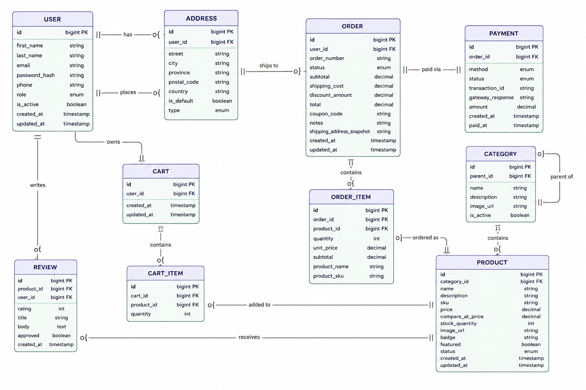

# Combined P5Store Documentation

## Embedded ERD HTML



> Static fallback above — GitHub strips `<script>` tags from README HTML, so the interactive Mermaid version below won't render on the repo page. Kept for local/tooling use.

```html

<style>
#erd { padding: 1rem 0; }
#erd svg { max-width: 100%; }
</style>
<h2 class="sr-only" style="position:absolute;width:1px;height:1px;overflow:hidden">P5Store Entity Relationship Diagram showing all database tables and their relationships</h2>
<div id="erd"></div>
<script type="module">
import mermaid from 'https://esm.sh/mermaid@11/dist/mermaid.esm.min.mjs';
const dark = matchMedia('(prefers-color-scheme: dark)').matches;
await document.fonts.ready;
mermaid.initialize({
  startOnLoad: false,
  theme: 'base',
  fontFamily: '"Anthropic Sans", sans-serif',
  themeVariables: {
    darkMode: dark,
    fontSize: '13px',
    fontFamily: '"Anthropic Sans", sans-serif',
    lineColor: dark ? '#9c9a92' : '#73726c',
    textColor: dark ? '#c2c0b6' : '#3d3d3a',
    primaryColor: dark ? '#26215C' : '#EEEDFE',
    primaryTextColor: dark ? '#CECBF6' : '#3C3489',
    primaryBorderColor: dark ? '#3C3489' : '#534AB7',
    secondaryColor: dark ? '#04342C' : '#E1F5EE',
    tertiaryColor: dark ? '#412402' : '#FAEEDA',
  },
});

const diagram = `erDiagram
  USER {
    bigint id PK
    string first_name
    string last_name
    string email
    string password_hash
    string phone
    enum role
    boolean is_active
    timestamp created_at
    timestamp updated_at
  }
  ADDRESS {
    bigint id PK
    bigint user_id FK
    string street
    string city
    string province
    string postal_code
    string country
    boolean is_default
    enum type
  }
  CATEGORY {
    bigint id PK
    bigint parent_id FK
    string name
    string description
    string image_url
    boolean is_active
  }
  PRODUCT {
    bigint id PK
    bigint category_id FK
    string name
    string description
    string sku
    decimal price
    decimal compare_at_price
    int stock_quantity
    string image_url
    string badge
    boolean featured
    enum status
    timestamp created_at
    timestamp updated_at
  }
  CART {
    bigint id PK
    bigint user_id FK
    timestamp created_at
    timestamp updated_at
  }
  CART_ITEM {
    bigint id PK
    bigint cart_id FK
    bigint product_id FK
    int quantity
  }
  ORDER {
    bigint id PK
    bigint user_id FK
    string order_number
    enum status
    decimal subtotal
    decimal shipping_cost
    decimal discount_amount
    decimal total
    string coupon_code
    string notes
    string shipping_address_snapshot
    timestamp created_at
    timestamp updated_at
  }
  ORDER_ITEM {
    bigint id PK
    bigint order_id FK
    bigint product_id FK
    int quantity
    decimal unit_price
    decimal subtotal
    string product_name
    string product_sku
  }
  PAYMENT {
    bigint id PK
    bigint order_id FK
    enum method
    enum status
    string transaction_id
    string gateway_response
    decimal amount
    timestamp created_at
    timestamp paid_at
  }
  REVIEW {
    bigint id PK
    bigint product_id FK
    bigint user_id FK
    int rating
    string title
    text body
    boolean approved
    timestamp created_at
  }

  USER ||--o{ ADDRESS : "has"
  USER ||--o{ ORDER : "places"
  USER ||--|| CART : "owns"
  USER ||--o{ REVIEW : "writes"
  CATEGORY ||--o{ PRODUCT : "contains"
  CATEGORY ||--o{ CATEGORY : "parent of"
  PRODUCT ||--o{ CART_ITEM : "added to"
  PRODUCT ||--o{ REVIEW : "receives"
  CART ||--o{ CART_ITEM : "contains"
  ORDER ||--o{ ORDER_ITEM : "contains"
  ORDER ||--|| PAYMENT : "paid via"
  ORDER }o--|| ADDRESS : "ships to"
  PRODUCT ||--o{ ORDER_ITEM : "ordered as"
`;

const { svg } = await mermaid.render('erd-svg', diagram);
document.getElementById('erd').innerHTML = svg;

document.querySelectorAll('#erd svg .node').forEach(node => {
  const firstPath = node.querySelector('path[d]');
  if (!firstPath) return;
  const d = firstPath.getAttribute('d');
  const nums = d.match(/-?[\d.]+/g)?.map(Number);
  if (!nums || nums.length < 8) return;
  const xs = [nums[0], nums[2], nums[4], nums[6]];
  const ys = [nums[1], nums[3], nums[5], nums[7]];
  const x = Math.min(...xs), y = Math.min(...ys);
  const w = Math.max(...xs) - x, h = Math.max(...ys) - y;
  const rect = document.createElementNS('http://www.w3.org/2000/svg', 'rect');
  rect.setAttribute('x', x); rect.setAttribute('y', y);
  rect.setAttribute('width', w); rect.setAttribute('height', h);
  rect.setAttribute('rx', '8');
  for (const a of ['fill', 'stroke', 'stroke-width', 'class', 'style']) {
    if (firstPath.hasAttribute(a)) rect.setAttribute(a, firstPath.getAttribute(a));
  }
  firstPath.replaceWith(rect);
});

document.querySelectorAll('#erd svg .row-rect-odd path, #erd svg .row-rect-even path').forEach(p => {
  p.setAttribute('stroke', 'none');
});
</script>

```

---

# P5Store — Java Spring Boot Backend

> Full backend for the P5Store e-commerce platform. Domain-driven, layered architecture with REST API, JPA entities, service layer, and comprehensive unit tests.

---

## Table of Contents

1. [Tech Stack](#tech-stack)
2. [ERD — Entity Relationship Diagram](#erd--entity-relationship-diagram)
3. [Entity Descriptions](#entity-descriptions)
4. [Relationships Summary](#relationships-summary)
5. [Project Structure](#project-structure)
6. [Layer-by-Layer Breakdown](#layer-by-layer-breakdown)
7. [API Endpoints](#api-endpoints)
8. [Running the Project](#running-the-project)
9. [Running the Tests](#running-the-tests)
10. [Configuration](#configuration)

---

## Tech Stack

| Layer          | Technology                          |
|----------------|-------------------------------------|
| Language       | Java 17                             |
| Framework      | Spring Boot 3.2                     |
| Persistence    | Spring Data JPA + Hibernate         |
| Database (dev) | H2 (in-memory)                      |
| Database (prod)| PostgreSQL                          |
| Security       | Spring Security + JWT (jjwt 0.11)   |
| Validation     | Jakarta Bean Validation             |
| Build          | Maven 3.x                           |
| Tests          | JUnit 5 + Mockito + AssertJ         |
| API Docs       | SpringDoc OpenAPI / Swagger UI      |

---

## ERD — Entity Relationship Diagram

```
┌──────────────────────────────────────────────────────────────────────┐
│                  P5STORE — ENTITY RELATIONSHIP DIAGRAM                │
└──────────────────────────────────────────────────────────────────────┘

                              ┌──────────────┐
                              │   CATEGORY   │
                              │──────────────│
                              │ PK id        │
                              │    name      │
                              │ description  │
                              │    image_url │
                              │    is_active │
                              │ FK parent_id │◄─────┐
                              └──────────────┘      │ self-ref
                                     │1             │
                                     │              │
                                    N│ 1:N          │
                                     ▼              │
                              ┌──────────────┐      │
                              │   PRODUCT    │      │
                              │──────────────│      │
                              │ PK id        │      │
                              │    name      │      │
                              │ description  │      │
                              │    sku       │      │
                              │    price     │      │
                              │ compare_price│      │
                              │    stock_qty │      │
                              │    image_url │      │
                              │    badge     │      │
                              │    featured  │      │
                              │    status    │      │
                              │ FK category_id├─────┘
                              │ created_at   │
                              │ updated_at   │
                              └──────────────┘
                                   │1
                    ┌──────────────┼──────────────┐
                    │              │              │
                   N│             N│             N│
                    ▼              ▼              ▼
            ┌──────────────┐ ┌──────────────┐ ┌──────────────┐
            │  CART_ITEM   │ │ ORDER_ITEM   │ │    REVIEW    │
            │──────────────│ │──────────────│ │──────────────│
            │ PK id        │ │ PK id        │ │ PK id        │
            │    quantity  │ │    quantity  │ │    rating    │
            │ FK cart_id   │ │ FK order_id  │ │    title     │
            │ FK product_id│ │ unit_price   │ │    body      │
            └──────────────┘ │    subtotal  │ │    approved  │
                    ▲        │ product_name │ │ FK user_id   │
                    │        │  product_sku │ │ FK product_id│
                    │        │ FK product_id│ └──────────────┘
                    │1       └──────────────┘
                    │              ▲
                   N│              │1
            ┌──────┴─────┐         │
            │    CART    │        N│
            │────────────│        ▼
            │ PK id      │  ┌──────────────┐
            │ created_at │  │    ORDER     │
            │ updated_at │  │──────────────│
            │ FK user_id │  │ PK id        │
            └────────────┘  │ order_number │
                 ▲          │    status    │
                 │          │    subtotal  │
                 │1         │ shipping_cost│
                 │          │ discount_amt │
                 │          │    total     │
            ┌────┴────────┐ │ coupon_code  │
            │    USER     │ │    notes     │
            │─────────────│ │ address_snap │
            │ PK id       │ │ FK user_id   │
            │ first_name  │ │ created_at   │
            │ last_name   │ │ updated_at   │
            │ email       │ └──────────────┘
            │ password_hash        │1
            │ phone       │        │
            │ role        │       N│
            │ is_active   │        │
            │ created_at  │        ▼
            │ updated_at  │  ┌──────────────┐
            └─────────────┘  │   PAYMENT    │
                 │1          │──────────────│
                 │           │ PK id        │
                 │           │    method    │
                 │           │    status    │
            ┌────┴──────────┐│ transaction_id
            │   ADDRESS     ││ gateway_resp │
            │───────────────││    amount    │
            │ PK id         ││ FK order_id  │
            │    street     │ │ created_at   │
            │    city       │ │    paid_at   │
            │    province   │ └──────────────┘
            │ postal_code   │ (1:1 relationship)
            │    country    │
            │  is_default   │
            │    type       │
            │ FK user_id    │
            └───────────────┘

  CARDINALITY LEGEND
  ──────────────────
  │1   = "one" side of relationship
  │N   = "many" side of relationship
  ─── = association line
  ◄── = foreign key points here (PK side)
```

---

## Entity Descriptions

### `USER`
The core actor. Holds auth credentials, personal details and role (CUSTOMER / ADMIN).
- One user → one Cart (created on registration)
- One user → many Orders
- One user → many Addresses
- One user → many Reviews

| Column         | Type         | Notes                              |
|----------------|--------------|------------------------------------|
| id             | BIGINT PK    | Auto-increment                     |
| email          | VARCHAR(100) | Unique, used as login identifier   |
| password_hash  | VARCHAR      | BCrypt hash                        |
| first_name     | VARCHAR(80)  |                                    |
| last_name      | VARCHAR(80)  |                                    |
| phone          | VARCHAR(20)  | Optional                           |
| role           | ENUM         | CUSTOMER \| ADMIN                  |
| is_active      | BOOLEAN      | Soft-disable without deletion      |
| created_at     | TIMESTAMP    | Auto-set on insert                 |
| updated_at     | TIMESTAMP    | Auto-updated                       |

---

### `CATEGORY`
Hierarchical product grouping. Supports parent → sub-category tree via self-referential FK.

| Column      | Type          | Notes                        |
|-------------|---------------|------------------------------|
| id          | BIGINT PK     |                              |
| name        | VARCHAR(100)  | Unique                       |
| description | VARCHAR(500)  | Optional                     |
| image_url   | VARCHAR(255)  | Optional banner image        |
| is_active   | BOOLEAN       |                              |
| parent_id   | BIGINT FK     | → categories.id (nullable)   |

---

### `PRODUCT`
The sellable item. Price, stock, category link and optional compare-at price for showing discounts.

| Column          | Type           | Notes                             |
|-----------------|----------------|-----------------------------------|
| id              | BIGINT PK      |                                   |
| name            | VARCHAR(200)   |                                   |
| description     | TEXT           | Optional                          |
| sku             | VARCHAR(100)   | Unique stock-keeping unit         |
| price           | DECIMAL(10,2)  | Current sale price                |
| compare_at_price| DECIMAL(10,2)  | Strikethrough/original price      |
| stock_quantity  | INT            | ≥ 0                               |
| image_url       | VARCHAR(255)   |                                   |
| badge           | VARCHAR(20)    | "-15%", "NEW", etc.               |
| featured        | BOOLEAN        | Shown on homepage                 |
| status          | ENUM           | ACTIVE/INACTIVE/OUT_OF_STOCK      |
| category_id     | BIGINT FK      | → categories.id                   |
| created_at      | TIMESTAMP      |                                   |
| updated_at      | TIMESTAMP      |                                   |

---

### `ADDRESS`
Shipping or billing address belonging to a user. Multiple per user; `is_default` flags the primary.

| Column     | Type          | Notes                        |
|------------|---------------|------------------------------|
| id         | BIGINT PK     |                              |
| street     | VARCHAR(100)  |                                    |
| city       | VARCHAR(100)  |                              |
| province   | VARCHAR(100)  | Optional                     |
| postal_code| VARCHAR(20)   |                              |
| country    | VARCHAR(100)  |                              |
| is_default | BOOLEAN       |                              |
| type       | ENUM          | SHIPPING \| BILLING          |
| user_id    | BIGINT FK     | → users.id                   |

---

### `CART`
One cart per user (1:1). Created automatically at user registration. Acts as a container for CartItems.

| Column    | Type      | Notes                  |
|-----------|-----------|------------------------|
| id        | BIGINT PK |                        |
| created_at| TIMESTAMP |                        |
| updated_at| TIMESTAMP |                        |
| user_id   | BIGINT FK | → users.id (UNIQUE)    |

---

### `CART_ITEM`
A line item inside a cart. Unique constraint on (cart_id, product_id) prevents duplicates.

| Column     | Type      | Notes                            |
|------------|-----------|----------------------------------|
| id         | BIGINT PK |                                  |
| quantity   | INT       | ≥ 1                              |
| cart_id    | BIGINT FK | → carts.id                       |
| product_id | BIGINT FK | → products.id                    |

---

### `ORDER`
An immutable purchase record created from the cart. Stores address as a snapshot string so history is preserved even if the address is later deleted.

| Column                 | Type           | Notes                                      |
|------------------------|----------------|--------------------------------------------|
| id                     | BIGINT PK      |                                            |
| order_number           | VARCHAR(50)    | Unique, human-readable (e.g. P5-ABC12345)  |
| status                 | ENUM           | PENDING→CONFIRMED→PROCESSING→SHIPPED→DELIVERED→CANCELLED→REFUNDED |
| subtotal               | DECIMAL(10,2)  |                                            |
| shipping_cost          | DECIMAL(10,2)  | Free above R500                            |
| discount_amount        | DECIMAL(10,2)  |                                            |
| total                  | DECIMAL(10,2)  | subtotal + shippingCost − discountAmount   |
| coupon_code            | VARCHAR(50)    | Optional                                   |
| notes                  | VARCHAR(500)   | Optional delivery notes                    |
| shipping_address_snapshot| VARCHAR(500)   | Captured at checkout                       |
| user_id                | BIGINT FK      | → users.id                                 |
| created_at             | TIMESTAMP      |                                            |
| updated_at             | TIMESTAMP      |                                            |

---

### `ORDER_ITEM`
Line items within an order. Stores product name/SKU as a snapshot — ensures order history is accurate even if the product is later changed or deleted.

| Column      | Type           | Notes                            |
|-------------|----------------|----------------------------------|
| id          | BIGINT PK      |                                  |
| quantity    | INT            |                                  |
| unit_price  | DECIMAL(10,2)  | Snapshot at time of purchase     |
| subtotal    | DECIMAL(10,2)  | quantity × unitPrice             |
| product_name| VARCHAR(200)   | Snapshot                         |
| product_sku | VARCHAR(100)   | Snapshot                         |
| order_id    | BIGINT FK      | → orders.id                      |
| product_id  | BIGINT FK      | → products.id (nullable)         |

---

### `PAYMENT`
One-to-one with Order. Tracks payment provider response and status separately from the order itself.

| Column          | Type          | Notes                             |
|-----------------|---------------|-----------------------------------|
| id              | BIGINT PK     |                                   |
| amount          | DECIMAL(10,2) |                                   |
| method          | ENUM          | PAYPAL/VISA/MASTERCARD/MAESTRO    |
| status          | ENUM          | PENDING/COMPLETED/FAILED/REFUNDED |
| transaction_id  | VARCHAR(200)  | External provider reference       |
| gateway_response| VARCHAR(500)  | Raw provider response             |
| order_id        | BIGINT FK     | → orders.id (UNIQUE)              |
| created_at      | TIMESTAMP     |                                   |
| paid_at         | TIMESTAMP     | Set when COMPLETED                |

---

### `REVIEW`
Product review from a verified user. Unique constraint on (user_id, product_id) — one review per product per user. Reviews require admin approval before they display publicly.

| Column     | Type         | Notes                           |
|------------|--------------|---------------------------------|
| id         | BIGINT PK    |                                 |
| rating     | INT          | 1–5                             |
| title      | VARCHAR(200) | Optional                        |
| body       | TEXT         | Optional                        |
| approved   | BOOLEAN      | False until admin approves      |
| user_id    | BIGINT FK    | → users.id                      |
| product_id | BIGINT FK    | → products.id                   |
| created_at | TIMESTAMP    |                                 |

---

## Relationships Summary

| From       | To         | Type        | FK Column           | Notes                                      |
|------------|------------|-------------|---------------------|--------------------------------------------|
| CATEGORY   | CATEGORY   | Many→One    | parent_id           | Self-referential sub-category tree         |
| PRODUCT    | CATEGORY   | Many→One    | category_id         | Every product belongs to one category      |
| CART       | USER       | One→One     | user_id             | One cart per user, created at registration |
| CART_ITEM  | CART       | Many→One    | cart_id             | Many items per cart                        |
| CART_ITEM  | PRODUCT    | Many→One    | product_id          | Each line references one product           |
| ORDER      | USER       | Many→One    | user_id             | A user can have many orders                |
| ORDER_ITEM | ORDER      | Many→One    | order_id            | Many items per order                       |
| ORDER_ITEM | PRODUCT    | Many→One    | product_id          | Nullable — product may be deleted later    |
| PAYMENT    | ORDER      | One→One     | order_id            | One payment per order                      |
| ADDRESS    | USER       | Many→One    | user_id             | Multiple addresses per user                |
| REVIEW     | USER       | Many→One    | user_id             | A user may review many products            |
| REVIEW     | PRODUCT    | Many→One    | product_id          | Unique per (user, product) pair            |

---

## Project Structure

```
p5store/
├── pom.xml
└── src/
    ├── main/
    │   ├── java/com/p5store/
    │   │   ├── P5StoreApplication.java          ← entry point
    │   │   ├── config/
    │   │   │   └── SecurityConfig.java          ← Spring Security + BCrypt
    │   │   ├── domain/                          ← JPA entities (pure domain model)
    │   │   │   ├── User.java
    │   │   │   ├── Category.java
    │   │   │   ├── Product.java
    │   │   │   ├── Address.java
    │   │   │   ├── Cart.java
    │   │   │   ├── CartItem.java
    │   │   │   ├── Order.java
    │   │   │   ├── OrderItem.java
    │   │   │   ├── Payment.java
    │   │   │   └── Review.java
    │   │   ├── repository/                      ← Spring Data JPA interfaces
    │   │   │   ├── UserRepository.java
    │   │   │   ├── CategoryRepository.java
    │   │   │   ├── ProductRepository.java
    │   │   │   ├── CartRepository.java
    │   │   │   ├── OrderRepository.java
    │   │   │   ├── AddressRepository.java
    │   │   │   └── ReviewRepository.java
    │   │   ├── service/                         ← service interfaces
    │   │   │   ├── UserService.java
    │   │   │   ├── ProductService.java
    │   │   │   ├── CartService.java
    │   │   │   └── OrderService.java
    │   │   │   └── impl/                        ← service implementations
    │   │   │       ├── JwtService.java
    │   │   │       ├── UserServiceImpl.java
    │   │   │       ├── ProductServiceImpl.java
    │   │   │       ├── CartServiceImpl.java
    │   │   │       └── OrderServiceImpl.java
    │   │   ├── controller/                      ← REST controllers
    │   │   │   ├── AuthController.java
    │   │   │   ├── ProductController.java
    │   │   │   ├── CartController.java
    │   │   │   └── OrderController.java
    │   │   ├── dto/
    │   │   │   ├── request/
    │   │   │   │   ├── RegisterRequest.java
    │   │   │   │   ├── LoginRequest.java
    │   │   │   │   ├── ProductRequest.java
    │   │   │   │   ├── CartItemRequest.java
    │   │   │   │   └── PlaceOrderRequest.java
    │   │   │   └── response/
    │   │   │       ├── AuthResponse.java
    │   │   │       ├── UserResponse.java
    │   │   │       ├── ProductResponse.java
    │   │   │       ├── CartResponse.java
    │   │   │       └── OrderResponse.java
    │   │   └── exception/
    │   │       ├── ResourceNotFoundException.java
    │   │       ├── BusinessException.java
    │   │       └── GlobalExceptionHandler.java
    │   └── resources/
    │       └── application.properties
    └── test/
        └── java/com/p5store/service/
            ├── ProductServiceTest.java          ← 10 tests
            ├── UserServiceTest.java             ← 7 tests
            ├── CartServiceTest.java             ← 7 tests
            └── OrderServiceTest.java            ← 6 tests
```

---

## Layer-by-Layer Breakdown

```
 ┌─────────────────────────────────────────────────┐
 │              REST Controllers                    │  ← HTTP in/out, validation
 │  AuthController  ProductController  CartCtrl … │
 └───────────────────────┬─────────────────────────┘
                         │ calls
 ┌───────────────────────▼─────────────────────────┐
 │              Service Interfaces                  │  ← Business logic contracts
 │  UserService  ProductService  CartService  …    │
 └───────────────────────┬─────────────────────────┘
                         │ implemented by
 ┌───────────────────────▼─────────────────────────┐
 │            Service Implementations               │  ← Business rules, transactions
 │  UserServiceImpl  ProductServiceImpl  …         │
 └───────────────────────┬─────────────────────────┘
                         │ calls
 ┌───────────────────────▼─────────────────────────┐
 │              Repositories                        │  ← Data access (Spring Data JPA)
 │  UserRepo  ProductRepo  CartRepo  OrderRepo …   │
 └───────────────────────┬─────────────────────────┘
                         │ maps to
 ┌───────────────────────▼─────────────────────────┐
 │              Domain Entities                     │  ← JPA-mapped POJOs
 │  User  Product  Category  Order  Cart  …        │
 └───────────────────────┬─────────────────────────┘
                         │
 ┌───────────────────────▼─────────────────────────┐
 │           Database (H2 dev / PostgreSQL prod)    │
 └─────────────────────────────────────────────────┘
```

---

## API Endpoints

### Auth
| Method | Path                      | Description              | Auth |
|--------|---------------------------|--------------------------|------|
| POST   | /api/v1/auth/register     | Register new user        | No   |
| POST   | /api/v1/auth/login        | Login, receive JWT       | No   |

### Products
| Method | Path                                   | Description                 | Auth  |
|--------|----------------------------------------|-----------------------------|-------|
| GET    | /api/v1/products                       | Paginated product list      | No    |
| GET    | /api/v1/products/{id}                  | Get by ID                   | No    |
| GET    | /api/v1/products/sku/{sku}             | Get by SKU                  | No    |
| GET    | /api/v1/products/featured              | Featured products           | No    |
| GET    | /api/v1/products/new-arrivals          | Latest 8 products           | No    |
| GET    | /api/v1/products/category/{categoryId} | Products by category        | No    |
| GET    | /api/v1/products/search?q=             | Full-text search            | No    |
| GET    | /api/v1/products/price-range?min=&max= | Filter by price range       | No    |
| POST   | /api/v1/products                       | Create product              | Admin |
| PUT    | /api/v1/products/{id}                  | Update product              | Admin |
| DELETE | /api/v1/products/{id}                  | Soft-delete product         | Admin |

### Cart
| Method | Path                                        | Description          | Auth     |
|--------|---------------------------------------------|----------------------|----------|
| GET    | /api/v1/users/{userId}/cart                 | Get cart             | Required |
| POST   | /api/v1/users/{userId}/cart/items           | Add item             | Required |
| PATCH  | /api/v1/users/{userId}/cart/items/{prodId}  | Update item qty      | Required |
| DELETE | /api/v1/users/{userId}/cart/items/{prodId}  | Remove item          | Required |
| DELETE | /api/v1/users/{userId}/cart                 | Clear cart           | Required |

### Orders
| Method | Path                                           | Description          | Auth     |
|--------|------------------------------------------------|----------------------|----------|
| POST   | /api/v1/users/{userId}/orders                  | Place order          | Required |
| GET    | /api/v1/users/{userId}/orders                  | User's order history | Required |
| GET    | /api/v1/orders/{orderId}                       | Get order by ID      | Required |
| GET    | /api/v1/orders/number/{orderNumber}            | Get by order number  | Required |
| PATCH  | /api/v1/orders/{orderId}/status?status=        | Update status        | Admin    |
| POST   | /api/v1/users/{userId}/orders/{orderId}/cancel | Cancel order         | Required |

---

## Running the Project

### Prerequisites
- Java 17+
- Maven 3.8+

### Start
```bash
cd p5store
mvn spring-boot:run
```

The server starts on **http://localhost:8080**

### Swagger UI
```
http://localhost:8080/swagger-ui.html
```

### H2 Console (dev only)
```
http://localhost:8080/h2-console
JDBC URL: jdbc:h2:mem:p5storedb
Username: sa
Password: (empty)
```

### Switch to PostgreSQL
In `application.properties`, replace the H2 block with:
```properties
spring.datasource.url=jdbc:postgresql://localhost:5432/p5store
spring.datasource.username=your_user
spring.datasource.password=your_password
spring.jpa.database-platform=org.hibernate.dialect.PostgreSQLDialect
spring.jpa.hibernate.ddl-auto=update
```

---

## Running the Tests

```bash
mvn test
```

### Test Coverage Summary

| Test Class          | Tests | What's Covered                                               |
|---------------------|-------|--------------------------------------------------------------|
| ProductServiceTest  | 10    | create, duplicate SKU, category not found, zero-stock, get, update, delete, paginate |
| UserServiceTest     | 7     | register, duplicate email, login, wrong password, inactive account, get user, not found |
| CartServiceTest     | 7     | add item, merge quantity, out of stock, exceed stock, product not found, remove, clear |
| OrderServiceTest    | 6     | place order + stock deduction, empty cart, bad address, wrong user, insufficient stock, cancel |
| **Total**           | **30**|                                                              |

All tests use **Mockito** (no Spring context loaded) — fast, isolated, pure unit tests.

---

## Configuration

| Property                   | Default                          | Description                  |
|----------------------------|----------------------------------|------------------------------|
| server.port                | 8080                             | HTTP port                    |
| app.jwt.secret             | (change in prod!)                | 256-bit HMAC secret          |
| app.jwt.expiration-ms      | 86400000                         | 24h token expiry             |
| spring.jpa.show-sql        | true                             | Log SQL in dev               |
| spring.jpa.hibernate.ddl-auto | create-drop                   | Recreate schema on restart   |

> ⚠️ **Production checklist**: change `jwt.secret`, set `ddl-auto=validate`, switch to PostgreSQL, enable HTTPS.
